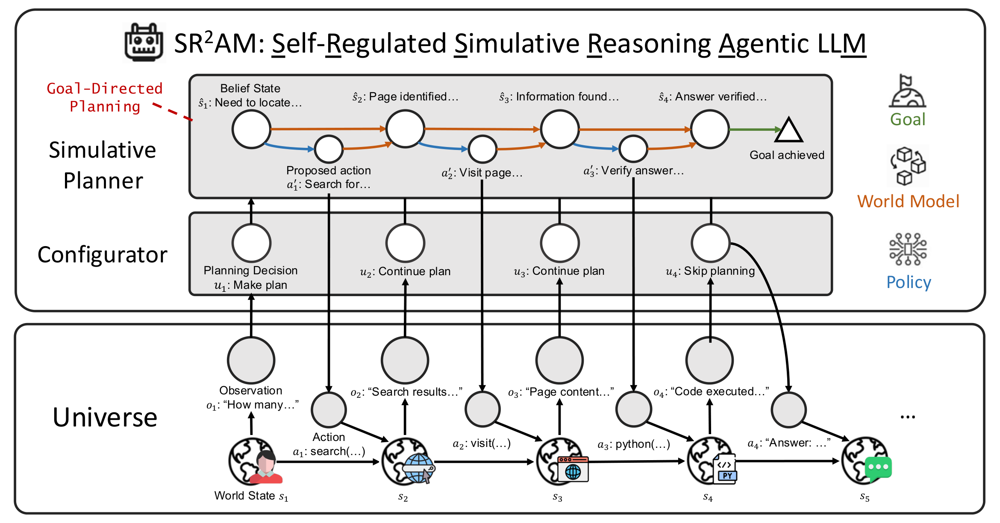
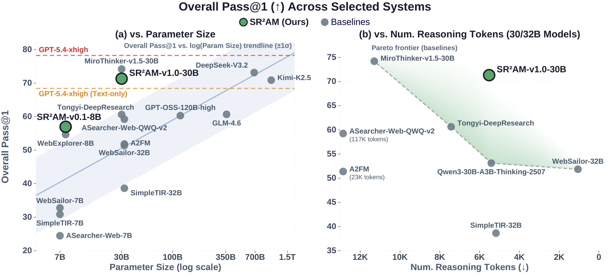

<div align="center">

<h1>SR²AM: Efficient Agentic Reasoning Through Self-Regulated Simulative Planning</h1>

<div align="center">
  
</div>

[](https://arxiv.org/abs/2605.22138)
[](https://sailing-lab.github.io/sr2am-self-regulated-planning)
[](https://huggingface.co/sailing-lab/SR2AM-v0.1-8B)
[](https://huggingface.co/sailing-lab/SR2AM-v1.0-30B)
[](LICENSE)

</div>

## Introduction

We argue that efficient agentic reasoning benefits from decomposing deliberation into three interacting systems: **reactive execution** (System I) for fine-grained reasoning and direct action; **simulative reasoning** (System II) that predicts consequences of proposed actions through a world model, providing a unified planning mechanism across diverse tasks; and **self-regulation** (System III) that decides *when* and *how deeply* to plan through a learned **configurator**.

**SR²AM** (Self-Regulated Simulative Reasoning Agentic LLM) is our instantiation of this decomposition: the configurator and simulative planner are realized as distinct stages within an LLM's chain-of-thought reasoning, with the LLM itself serving as the world model in language space. By separating self-regulation, planning, and execution while preserving the expressiveness of free-form reasoning, SR²AM learns to plan *further ahead* rather than simply reason *more*, achieving competitive task performance with substantially fewer reasoning tokens.

For more details, visit our [project website](https://sailing-lab.github.io/sr2am-self-regulated-planning) or read the [paper](https://arxiv.org/abs/2605.22138).

We release two models:
- **SR²AM-v0.1-8B**: Based on Qwen3-8B, competitive with 120--355B systems
- **SR²AM-v1.0-30B**: Based on Qwen3-30B-A3B-Thinking-2507, competitive with 685B--1T systems while consuming 25--95% fewer reasoning tokens than comparably sized agentic LLMs

## Main Results

<div align="center">
  
</div>

SR²AM-v0.1-8B and SR²AM-v1.0-30B sit above the size-vs-accuracy trendline in (a), and SR²AM-v1.0-30B is on the Pareto frontier of reasoning-token efficiency vs. accuracy among 30/32B agentic models in (b). The full benchmark breakdown is in the [paper](https://arxiv.org/abs/2605.22138).

## Model Downloads

<div align="center">

| Model | HuggingFace | Total Parameters | Context Length |
|:------:|:------------:|:-----------:|:--------------:|
| SR²AM-v0.1-8B | [🤗 Link](https://huggingface.co/sailing-lab/SR2AM-v0.1-8B) | 8B | 32K |
| SR²AM-v1.0-30B | [🤗 Link](https://huggingface.co/sailing-lab/SR2AM-v1.0-30B) | 30B | 128K |

</div>

## Quick Start

This guide walks you through running SR²AM on your own dataset.

### 1. Installation

<details>
<summary>Install dependencies and configure API keys</summary>

```bash
# Option A: uv (recommended, faster)
uv venv .venv --python 3.13
source .venv/bin/activate
uv pip install --no-deps -r requirements.txt

# Option B: pip
pip install -r requirements.txt

# Configure API keys
cp .env.example .env
# Edit .env with your API keys (see Prerequisites below)
source .env
```

> **Note**: `requirements.txt` is a frozen environment snapshot. If you see dependency resolution errors, use `--no-deps` to skip resolution (all transitive dependencies are already included). See [Troubleshooting](#troubleshooting) for common issues.

</details>

### 2. Prerequisites

SR²AM uses three external tools during inference. Configure them in your `.env` file:

| Service | Purpose | Required? | Environment Variable |
|:--------|:--------|:---------:|:---------------------|
| [SerpAPI](https://serpapi.com/) | Web search (default provider) | Yes | `SERPAPI_API_KEY` |
| Browsing summarizer LLM | Webpage content summarization | Yes | `BROWSING_SUMMARIZE_MODEL`, `BROWSING_SUMMARIZE_URL` |
| [SandboxFusion](https://github.com/bytedance/SandboxFusion) | Python code execution | Yes | `CODE_SANDBOX_SERVERS` |
| [SGLang](https://github.com/sgl-project/sglang) | Model serving | Yes | (installed via requirements) |
| OpenAI API key | Evaluation scoring (test benchmarks) | For eval | `OPENAI_API_KEY` |

> **Search provider**: [SerpAPI](https://serpapi.com/) is the default. To use [Serper.dev](https://serper.dev/) instead, set `SERPER_DEV_API_KEY` in your `.env` and pass `--extra-args "--search_provider serper_dev"` to the inference script.

> **Evaluation scoring**: Test benchmark evaluation (AIME, MATH500, GPQA, BrowseComp, GAIA, etc.) uses `OPENAI_API_KEY` for LLM-based scoring.

**Browsing summarizer**: Any OpenAI-compatible instruct LLM endpoint works (e.g., `Qwen3-30B-A3B-Instruct-2507`). This model summarizes webpage content for the agent's `visit_tool`.

**Code sandbox**: Use [`scripts/sandbox/setup_sandbox.sh`](scripts/sandbox/setup_sandbox.sh) for automated setup (pulls the [SandboxFusion](https://github.com/bytedance/SandboxFusion) image, installs required packages, and verifies). See [Code Sandbox setup](#code-sandbox-setup) below for details.

### 3. Download Model

<details>
<summary>Download from HuggingFace</summary>

```bash
# SR2AM-v0.1-8B (requires ~16GB VRAM)
huggingface-cli download sailing-lab/SR2AM-v0.1-8B --local-dir ./models/SR2AM-v0.1-8B

# SR2AM-v1.0-30B (requires ~4x GPUs with TP=4)
huggingface-cli download sailing-lab/SR2AM-v1.0-30B --local-dir ./models/SR2AM-v1.0-30B
```

</details>

### 4. Prepare Input Data

Input files are JSONL format. Each line must contain:

| Field | Required | Description |
|:------|:--------:|:------------|
| `question` | Yes | The question text |
| `general_domain` | Yes | Dataset category for grouping results (e.g., `math__aime24`, `stem__gpqa_diamond`, `web__gaia`) |
| `reward_model` | For eval | Ground truth for scoring: `{"ground_truth": "...", "style": "rule"}` |
| `answer` | For eval | Alternative to `reward_model` for simple string ground truth |
| `data_source` | No | Optional metadata (e.g., `math__aime_repeated_8x`) |
| `extra_info` | No | Optional metadata passed to the reward scorer |

<details>
<summary>Example (matches our test benchmark format)</summary>

```json
{"id": "aime24-0", "question": "Every morning ...", "reward_model": {"ground_truth": "xxx", "style": "rule"}, "data_source": "math__aime_repeated_8x", "general_domain": "math__aime24"}
{"id": "gpqa_diamond-0", "question": "Which of ...", "reward_model": {"ground_truth": "xxx", "style": "rule"}, "data_source": "stem__gpqa_diamond_198", "general_domain": "stem__gpqa_diamond"}
{"id": "gaia-0", "question": "How many ...", "answer": "xxx", "general_domain": "web__gaia"}
```

</details>

> The `general_domain` field is used as the dataset category in results (shown as `dataset` in output). Results are grouped by this field when computing per-dataset pass rates.

> Following the [Guru](https://arxiv.org/abs/2506.14965) paper, all questions are appended with the instruction `" You should provide your final answer in the format \boxed{YOUR_ANSWER}."` to standardize the answer format for evaluation.

### 5. Run Inference

#### Option A: Single-Machine (no SLURM)

<details>
<summary>Single-machine inference examples</summary>

```bash
source .env  # Load API keys

# SR2AM-v0.1-8B on 8 GPUs (TP=1, DP=8)
bash scripts/run_inference_local.sh \
  --model-path ./models/SR2AM-v0.1-8B \
  --model-name SR2AM-v0.1-8B \
  --model-size 8b \
  --input-file data/test_questions.jsonl \
  --output-file outputs/sr2am-v0.1-8b-results.jsonl \
  --browsing-summarize-model Qwen/Qwen3-30B-A3B-Instruct-2507-FP8 \
  --browsing-summarize-url http://SUMMARIZER_HOST:30000/v1 \
  --code-sandbox-servers "SANDBOX_HOST1 SANDBOX_HOST2" \
  --evaluate

# SR2AM-v1.0-30B on 8 GPUs (TP=4, DP=2)
bash scripts/run_inference_local.sh \
  --model-path ./models/SR2AM-v1.0-30B \
  --model-name SR2AM-v1.0-30B \
  --model-size 30b \
  --input-file data/test_questions.jsonl \
  --output-file outputs/sr2am-v1.0-30b-results.jsonl \
  --browsing-summarize-model Qwen/Qwen3-30B-A3B-Instruct-2507-FP8 \
  --browsing-summarize-url http://SUMMARIZER_HOST:30000/v1 \
  --code-sandbox-servers "SANDBOX_HOST1 SANDBOX_HOST2" \
  --evaluate

# SR2AM-v1.0-30B on 4 GPUs (TP=4, DP=1)
bash scripts/run_inference_local.sh \
  --model-path ./models/SR2AM-v1.0-30B \
  --model-name SR2AM-v1.0-30B \
  --model-size 30b \
  --num-gpus 4 \
  --input-file data/test_questions.jsonl \
  --output-file outputs/sr2am-v1.0-30b-results.jsonl \
  --browsing-summarize-model Qwen/Qwen3-30B-A3B-Instruct-2507-FP8 \
  --browsing-summarize-url http://SUMMARIZER_HOST:30000/v1 \
  --code-sandbox-servers "SANDBOX_HOST1 SANDBOX_HOST2"
```

</details>

The script automatically starts an SGLang server, waits for it to be ready, runs inference, and cleans up.

Run `bash scripts/run_inference_local.sh --help` for all options. See [Paper Reproduction](#paper-reproduction) below for the full settings used in the paper.

#### Option B: SLURM Cluster

<details>
<summary>SLURM inference examples</summary>

```bash
# 8B model (1 node, 8 GPUs)
sbatch scripts/run_inference_slurm_8b.sh \
  ~/models/SR2AM-v0.1-8B \
  SR2AM-v0.1-8B \
  ~/data/test_questions.jsonl \
  sr2am-v0.1-8b-results.jsonl \
  Qwen/Qwen3-30B-A3B-Instruct-2507-FP8 \
  http://SUMMARIZER_HOST:30000/v1 \
  64 1 \
  "--fix_datetime --filtering --remove_tags --no_break_early --agent_type think --max_turns 50 --max_completion_tokens 16384 --temperature 0.8 --code_sandbox_servers SANDBOX_HOST1 SANDBOX_HOST2"

# 30B model (2 nodes, 16 GPUs)
sbatch scripts/run_inference_slurm_30b.sh \
  ~/models/SR2AM-v1.0-30B \
  SR2AM-v1.0-30B \
  ~/data/test_questions.jsonl \
  sr2am-v1.0-30b-results.jsonl \
  Qwen/Qwen3-30B-A3B-Instruct-2507-FP8 \
  http://SUMMARIZER_HOST:30000/v1 \
  64 1 \
  "--fix_datetime --filtering --remove_tags --no_break_early --agent_type think --max_turns 100 --max_completion_tokens 16384 --temperature 1.0 --code_sandbox_servers SANDBOX_HOST1 SANDBOX_HOST2"
```

</details>

### 6. Evaluation

The inference scripts run with `--filtering` by default, which scores each response against the ground truth during inference. The output JSONL contains a `correct` field per response, so no separate judging step is needed.

<details>
<summary>Print results</summary>

```bash
# Print pass rate and pass@k by dataset
python evaluation/compute_rep_results.py \
  --input_file outputs/sr2am-v1.0-30b-results.jsonl \
  --num_reps 1

# Count reasoning tokens per trajectory
python avg_tokens_before_think_close.py \
  --input outputs/sr2am-v1.0-30b-results.jsonl \
  --model ./models/SR2AM-v1.0-30B \
  --breakdown-by-dataset

# For 8B (uses --assistant-text-source configurator)
python avg_tokens_before_think_close.py \
  --input outputs/sr2am-v0.1-8b-results.jsonl \
  --model ./models/SR2AM-v0.1-8B \
  --assistant-text-source configurator \
  --breakdown-by-dataset
```

</details>

<details>
<summary>Post-hoc re-scoring (optional)</summary>

For re-judging with a different model or scoring external system outputs:

```bash
# Re-judge answers against ground truth
python evaluation/run_judge_results.py \
  --system direct-api \
  --dataset_path data/test_questions.jsonl \
  --answers_path outputs/sr2am-v1.0-30b-results.jsonl \
  --output_name sr2am-v1.0-30b \
  --remove_tags

# Analyze judge results by data source
python evaluation/analyze_judge_results.py \
  --paths evaluation/judged_sr2am-v1.0-30b.json
```

</details>

## Tools

SR²AM uses three external tools during inference:

### Web Search (`web_search`)
Queries web-scale information via SerpAPI (default) or Serper.dev. Supports multiple simultaneous queries. The default provider is SerpAPI (`SERPAPI_API_KEY`). To use Serper.dev instead, pass `--search_provider serper_dev` and set `SERPER_DEV_API_KEY`.

### Web Browser (`visit_tool`)
Crawls and summarizes webpage content using an LLM summarizer. Truncates pages to 28K tokens. Requires an OpenAI-compatible LLM endpoint for summarization (e.g., `Qwen3-30B-A3B-Instruct-2507`).

### Code Sandbox (`python_repl_tool`)
Stateless Python sandbox via [SandboxFusion](https://github.com/bytedance/SandboxFusion). The sandbox must have common scientific and domain-specific Python packages pre-installed (see `scripts/sandbox/sandbox-requirements.txt` for the full list).

### Code Sandbox setup

Requires [Enroot](https://github.com/NVIDIA/enroot):

```bash
# 1. Pull image, start server, install all packages, and export a reusable .sqsh
bash scripts/sandbox/setup_sandbox.sh --export sr2am_sandbox.sqsh

# 2. Verify the sandbox has all required packages
bash scripts/sandbox/verify_sandbox.sh --host localhost --port 8080

# 3. Deploy with automatic restart (for long-running inference)
bash scripts/sandbox/run_sandbox_retry.sh -i sr2am_sandbox.sqsh
```

Or install into a remote server that's already running:

```bash
bash scripts/sandbox/setup_sandbox.sh --skip-pull --host SANDBOX_HOST
```

Configure with `--code-sandbox-servers "HOST1 HOST2"` in the inference script. Each server listens on port 8080.

## Paper Reproduction

All paper results use SerpAPI (the default search provider) and a fixed system prompt datetime (`Sun Aug 31 2025 23:34:17`). Pass `--fix_datetime` via `--extra-args` to enable.

<details>
<summary>Build the full test set</summary>

The headline Pass@1 numbers are computed over a full test set of **8219 questions across 11 benchmarks**, with each benchmark repeated to reduce variance (aime24/aime25 ×32; gpqa_diamond/gaia/xbench_deepsearch ×4; all others ×1). The set is assembled from three upstream sources — obtain each and point the script at your local copies via environment variables:

| Benchmarks | Source | Files |
|:------|:-------|:------|
| aime24, aime25, math500, gpqa_diamond, supergpqa, finqa, multihier | HF dataset [`LLM360/guru-RL-92k`](https://huggingface.co/datasets/LLM360/guru-RL-92k), `offline_eval/` subdir | `math__aime_repeated_8x_240.parquet`, `math__aime2025_repeated_8x_240.parquet`, `math__math_500.parquet`, `stem__gpqa_diamond_198.parquet`, `stem__supergpqa_1k.parquet`, `table__finqa_1.1k.parquet`, `table__multihier_336.parquet` |
| browsecomp, hle, gaia | GitHub [`OPPO-PersonalAI/Agent_Foundation_Models`](https://github.com/OPPO-PersonalAI/Agent_Foundation_Models), `AFM/data/web_agent/test_benchmarks/` | `browsecomp.json`, `hle_test.json`, `gaia_dev_103.json` |
| xbench_deepsearch | GitHub [`xbench-ai/xbench-evals`](https://github.com/xbench-ai/xbench-evals) | `data/DeepSearch-2505-decrypted.csv` (the repo ships an encrypted CSV — decrypt it per their instructions) |

```bash
# Point at your local copies of the three sources (defaults shown)
export SR2AM_GURU_EVAL_ROOT=~/guru-RL-92k/offline_eval
export SR2AM_AFM_BENCHMARKS_ROOT=~/Agent_Foundation_Models/AFM/data/web_agent/test_benchmarks
export SR2AM_XBENCH_ROOT=~/xbench-evals/data

python evaluation/prepare_test_data.py create_test_dataset_full \
  --output_file data/sr2am_test_full.jsonl
```

This writes 8219 questions to `data/sr2am_test_full.jsonl`. The builder does not shuffle; pass `--shuffle_questions` at inference time (below) to distribute the web questions evenly across workers.

</details>

<details>
<summary>Paper reproduction commands</summary>

Key settings: SerpAPI (default search provider), `--fix_datetime` for fixed system prompt datetime, `--temperature 1.0` for 30B / `0.8` for 8B.

```bash
source .env  # Load API keys (requires SERPAPI_API_KEY and OPENAI_API_KEY)

# SR2AM-v1.0-30B (8 GPUs, TP=4, DP=2)
bash scripts/run_inference_local.sh \
  --model-path ./models/SR2AM-v1.0-30B \
  --model-name SR2AM-v1.0-30B \
  --model-size 30b \
  --input-file data/sr2am_test_full.jsonl \
  --output-file outputs/sr2am-v1.0-30b-results.jsonl \
  --browsing-summarize-model Qwen/Qwen3-30B-A3B-Instruct-2507-FP8 \
  --browsing-summarize-url http://SUMMARIZER_HOST:30000/v1 \
  --code-sandbox-servers "SANDBOX_HOST1 SANDBOX_HOST2" \
  --extra-args "--fix_datetime --code_concurrency 128 --visit_concurrency 64 --search_concurrency 128 --shuffle_questions" \
  --evaluate

# SR2AM-v0.1-8B (8 GPUs, TP=1, DP=8)
bash scripts/run_inference_local.sh \
  --model-path ./models/SR2AM-v0.1-8B \
  --model-name SR2AM-v0.1-8B \
  --model-size 8b \
  --input-file data/sr2am_test_full.jsonl \
  --output-file outputs/sr2am-v0.1-8b-results.jsonl \
  --browsing-summarize-model Qwen/Qwen3-30B-A3B-Instruct-2507-FP8 \
  --browsing-summarize-url http://SUMMARIZER_HOST:30000/v1 \
  --code-sandbox-servers "SANDBOX_HOST1 SANDBOX_HOST2" \
  --extra-args "--fix_datetime --code_concurrency 64 --visit_concurrency 32 --search_concurrency 64 --shuffle_questions" \
  --evaluate
```

</details>

## Troubleshooting

**Dependency conflicts during install**: `requirements.txt` is a frozen environment snapshot. If you see resolution errors, use `uv pip install --no-deps -r requirements.txt` or `pip install --no-deps -r requirements.txt` to install without resolution.

**`outlines-core` build fails (Rust compiler)**: This package is an optional transitive dependency of SGLang. Remove it from `requirements.txt` if you don't have a Rust toolchain -- inference works without it.

**SGLang server won't start**: Check that your CUDA version matches the installed `torch` and `sglang` versions. The 30B model requires at least 4 GPUs (TP=4). Check `logs/sglang_server.log` for details.

**wandb login**: `run_agent.py` logs to Weights & Biases. Run `wandb login` first, or set `WANDB_MODE=disabled` to skip.

**Search provider**: SerpAPI is the default. To use Serper.dev, set `SERPER_DEV_API_KEY` in `.env` and pass `--search_provider serper_dev` via `--extra-args` (local script) or directly (when calling `run_agent.py`).

**`--extra-args` or `--code-sandbox-servers` ignored**: These flags take a single quoted string that is word-split when passed to `run_agent.py`. Make sure the value is in quotes: `--extra-args "--search_provider serper_dev --code_concurrency 128"`. If quoting is difficult (e.g., nested shell layers), call `run_agent.py` directly instead -- see `run_inference_local.sh` for the full argument list.

## Citation

If you find SR²AM useful in your research, please cite our paper:

```bibtex
@article{deng2026sr2am,
  title={Efficient Agentic Reasoning Through Self-Regulated Simulative Planning},
  author={Deng, Mingkai and Hou, Jinyu and Neves, Lara Sá and
          Pimpalkhute, Varad and Killian, Taylor W. and
          Liu, Zhengzhong and Xing, Eric P.},
  journal={arXiv preprint arXiv:2605.22138},
  year={2026}
}
```

## Acknowledgments

We thank the open-source community for the base models, training frameworks, serving engines, evaluation benchmarks, and tools that made this work possible.

## License

This project is released under the [Apache License 2.0](LICENSE).
